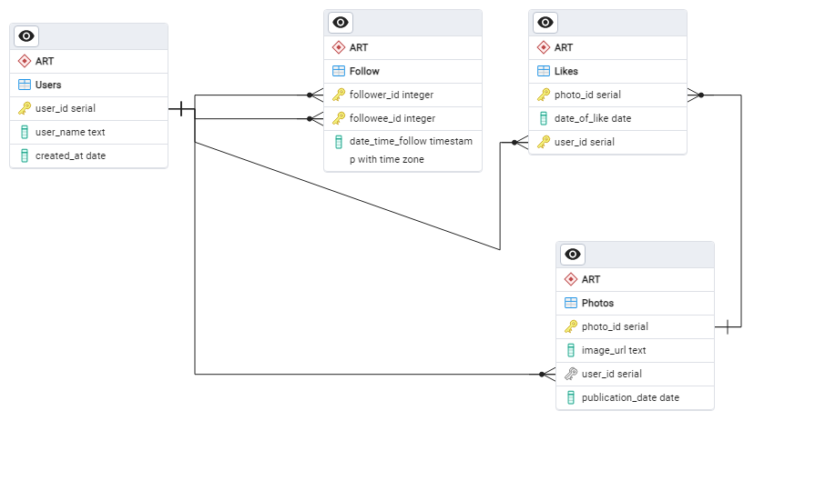

# Social Media Database Project  

This repository contains the SQL scripts and queries developed for **Databases 1 (Year 2, Semester 1) labs**.  
The project simulates a **mini social media platform**, modeling user interactions such as posting photos, liking content, and following other users.  

 

## 📂 Project Overview  

The database consists of **four main tables**:  

- **Users** – stores information about users (username, creation date).  
- **Photos** – stores uploaded photos and their publication details.  
- **Likes** – records likes given by users to photos.  
- **Follow** – tracks follower–followee relationships between users.  

Additionally, indexes, triggers, and analytical queries are included to demonstrate database optimization and functionality.  

 

## 🛠️ Features  

- **Database setup**:  
  - Creation of `Users`, `Photos`, `Likes`, and `Follow` tables.  
  - Foreign key constraints to maintain referential integrity.  
  - Sequence adjustments to control auto-increment starting points.  

- **Data population**:  
  - Insert statements to seed tables with sample data representing a small user network.  

- **Queries**:  
  - Retrieve users, photos, likes, and follower relationships.  
  - Aggregations such as number of likes per photo, number of photos per user.  
  - Search queries (e.g., usernames by length, photos without likes).  
  - Set operations (`UNION`, `INTERSECT`) to analyze overlapping user activities.  

- **Indexes**:  
  - Example of index creation (`user_name`, `publication_date`) with performance analysis using `EXPLAIN ANALYZE`.  

- **Trigger & Function**:  
  - `auto_follow()` function ensures that when a user likes a photo, they automatically follow the photo’s owner.  
  - Implemented with a trigger on the `Likes` table.  

 

## 📊 Example Use Cases  

- Find all users who liked a specific photo.  
- List users who have no uploaded photos.  
- Get the most liked photos.  
- Show mutual follower–followee relationships.  
- Automatically follow photo owners when liking their content.  

 

## 🚀 How to Run  

1. Run the SQL script in a **PostgreSQL** environment.  
2. The script will:  
   - Drop existing tables (if they exist).  
   - Create and populate the schema.  
   - Execute a series of queries for analysis.  
3. Explore the results to understand how users interact in this simulated social media platform.  

 

## 🖼️ ERD (Entity Relationship Diagram)  

Below is the ERD showing the relationships between the four tables:  

For verification, a reverse-engineered ERD is also included in the [`docs`](./docs) folder.  

 

## 📖 Learning Objectives  

This project demonstrates:  
- Designing relational schemas for social platforms.  
- Applying **primary/foreign keys** and constraints.  
- Using **joins, set operations, and aggregate functions**.  
- Creating and analyzing **indexes**.  
- Implementing **triggers** for automated actions.  

